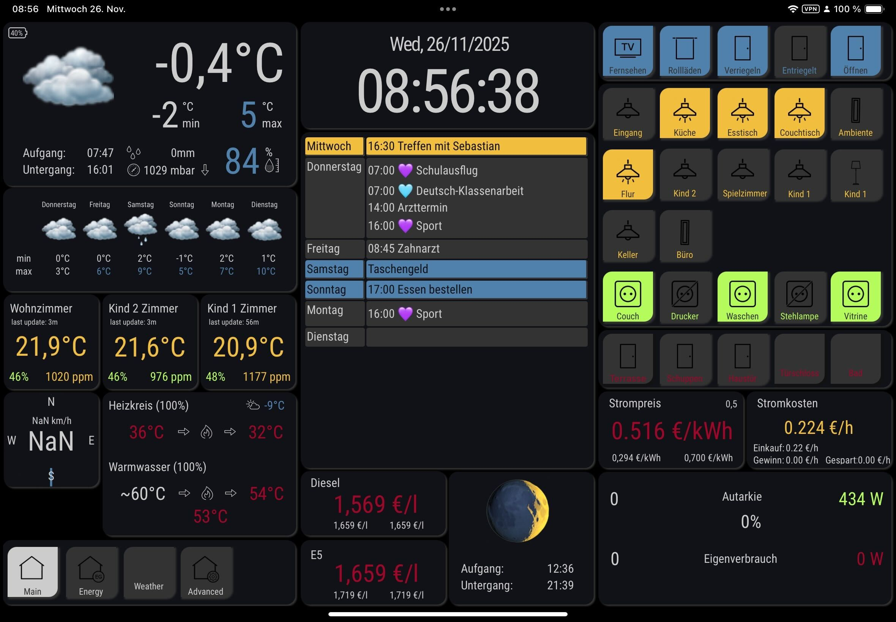

# Home Monitoring

A centralized monitoring system for smart home devices and services. This project focuses on collecting and storing metrics in InfluxDB; visualization is handled by external tools (for example Grafana or ioBroker) that read from InfluxDB.

**Integrations:** See [`integrations/`](integrations/) directory for ioBroker scripts and other integration tools.

## Supported Systems

- [Netatmo](https://www.netatmo.com/en-eu) - Smart home weather station (OAuth2 with lnetatmo library)
- [SolarEdge](https://www.solaredge.com/) - Solar inverter and PV monitoring
- [Gardena](https://www.gardena.com/de/produkte/smart/) - Smart gardening system
- [Tankerkoenig](https://creativecommons.tankerkoenig.de/) - Gas station price monitoring
- [Tibber](https://tibber.com/) - Smart energy monitoring
- Techem Compat V - Energy meter monitoring via nanoCUL USB Stick (requires pyserial)
- Dynu DNS - Dynamic DNS updates for remote access

## Installation

### Prerequisites

- Python 3.12.3 or higher
- Docker
- Git

### Setup Development Environment

1. Clone the repository:
```bash
git clone https://github.com/bigcrunsh/home-monitoring.git
cd home-monitoring
```

2. Initialize the project (creates virtual environment and installs dependencies):
```bash
make init
source .venv/bin/activate
```

3. Set up environment variables:
```bash
# .env is created by make init, edit with your configuration
nano .env
```

### Infrastructure Setup

Run InfluxDB via Docker (no Grafana container by default):

```bash
# Create persistent volume for InfluxDB data
docker volume create influxdb-storage

# Start the InfluxDB container
docker run -d \
  --restart unless-stopped \
  -p 8086:8086 \
  --name=influxdb \
  --volume influxdb-storage:/var/lib/influxdb/ \
  influxdb:1.8
```

Alternatively, you can use the Makefile helpers, which wrap the same commands:

```bash
make init-docker   # create influxdb-storage volume
make start-docker  # start (or create) the influxdb container
make logs-docker   # follow InfluxDB logs
make stop-docker   # stop the influxdb container
```

Service:
- InfluxDB: Time-series database (port 8086)

## Data Collection

### Configuration

All services are configured via environment variables. See `.env.example` for required variables.

### Running Data Collectors

Data collectors and utilities are Python modules located in `src/home_monitoring/scripts/`. Run them from the project root directory with PYTHONPATH set:

```bash
# Data Collection
PYTHONPATH=src python -m home_monitoring.scripts.collect_netatmo_data
PYTHONPATH=src python -m home_monitoring.scripts.collect_solaredge_data
PYTHONPATH=src python -m home_monitoring.scripts.collect_gardena_data
PYTHONPATH=src python -m home_monitoring.scripts.collect_tankerkoenig_data --cache-dir /path/to/cache
PYTHONPATH=src python -m home_monitoring.scripts.collect_tibber_data
PYTHONPATH=src python -m home_monitoring.scripts.collect_sam_digital_data
PYTHONPATH=src python -m home_monitoring.scripts.collect_techem_data --serial-port /dev/ttyUSB0

# DNS Updates
PYTHONPATH=src python -m home_monitoring.scripts.update_dns
```

Note: The `-v` flag is not supported by all scripts.

Additional options for specific collectors:

**Tibber:**
```bash
# Collect both prices and consumption data
PYTHONPATH=src python -m home_monitoring.scripts.collect_tibber_data

# Optional: specify custom user agent
PYTHONPATH=src python -m home_monitoring.scripts.collect_tibber_data --user-agent "MyApp/1.0"
```
- `collect_tankerkoenig_data.py`:
  - `--cache-dir`: Directory to cache station details
  - `--force-update`: Force update of station details from API
- `collect_techem_data.py`:
  - `--serial-port`: Serial port path (default: /dev/serial/by-id/usb-SHK_NANO_CUL_868-if00-port0)
  - `--serial-baudrate`: Baud rate (default: 38400)
  - `--serial-timeout`: Timeout in seconds (default: 300)
  - `--serial-num-packets`: Number of packets to collect (default: 5)

### Scheduling Collections

Create a crontab entry (`crontab -e`):

```bash
chmod +x /home/pi/run_home_monitoring.sh
```

Then your crontab becomes much cleaner:
```
*/5 * * * * /home/pi/run_home_monitoring.sh home_monitoring.scripts.collect_netatmo_data >> /var/log/home_monitoring/netatmo.log 2>&1
*/5 * * * * /home/pi/run_home_monitoring.sh home_monitoring.scripts.collect_solaredge_data >> /var/log/home_monitoring/solaredge.log 2>&1
*/5 * * * * /home/pi/run_home_monitoring.sh home_monitoring.scripts.collect_tankerkoenig_data --cache-dir /home/pi/src/github.com/BigCrunsh/home-monitoring/cache >> /var/log/home_monitoring/tankerkoenig.log 2>&1
*/30 * * * * /home/pi/run_home_monitoring.sh home_monitoring.scripts.collect_gardena_data >> /var/log/home_monitoring/gardena.log 2>&1
*/15 * * * * /home/pi/run_home_monitoring.sh home_monitoring.scripts.collect_tibber_data >> /var/log/home_monitoring/tibber.log 2>&1
*/5 * * * * /home/pi/run_home_monitoring.sh home_monitoring.scripts.collect_sam_digital_data >> /var/log/home_monitoring/sam_digital.log 2>&1
0 1 * * * /home/pi/run_home_monitoring.sh home_monitoring.scripts.collect_techem_data >> /var/log/home_monitoring/techem.log 2>&1
0 * * * * /home/pi/run_home_monitoring.sh home_monitoring.scripts.update_dns >> /var/log/home_monitoring/update_dns.log 2>&1
```

## Development

### Project Structure

```
src/
├── home_monitoring/
│   ├── core/         # Core business logic
│   ├── models/       # Data models
│   ├── repositories/ # Data access layer
│   ├── schemas/      # Data validation schemas
│   ├── scripts/      # Data collection scripts
│   ├── services/     # Service integrations
│   └── utils/        # Utility functions
tests/
├── unit/            # Unit tests
└── integration/     # Integration tests
```

### Development Commands

```bash
# Run all tests and quality checks
make test

# Run specific test suites
make test-unit
make test-integration

# Code quality
make lint          # Run all code quality checks
make format        # Format code with black
make type-check    # Run type checking
make ruff          # Run linting with ruff

# Clean up
make clean         # Remove Python artifacts and caches
```

### Code Quality Standards

- Black for code formatting
- Ruff for linting
- MyPy for type checking
- 100% test coverage for core functionality
- Docstrings required for public APIs
- Type hints required for all functions

## InfluxDB Measurements

The system writes all metrics to InfluxDB using a consistent
`<domain>_<metric>_<unit>` naming scheme (for example
`electricity_power_watt` or `garden_humidity_percentage`).

High-level categories:
- **Electricity & energy**: `electricity_energy_watthour`, `electricity_power_watt`, `electricity_prices_euro`
- **Garden & irrigation**: `garden_temperature_celsius`, `garden_humidity_percentage`, `garden_light_intensity_lux`, `garden_rf_link_level_percentage`, `garden_system_battery_percentage`, `garden_valves_activity`
- **Fuel prices**: `gas_prices_euro`
- **Heating**: `heat_energy_watthours`
- **Weather**: `weather_temperature_celsius`, `weather_humidity_percentage`, `weather_pressure_mbar`, `weather_windstrength_kph`, `weather_windangle_angles`, `weather_guststrength_kph`, `weather_gustangle_angles`, `weather_rain_mm`, `weather_noise_db`, `weather_system_battery_percentage`

For full details (fields, tags, update frequency) see
`INFLUXDB_MEASUREMENTS_DOCUMENTATION.md`.

## Querying InfluxDB

Once InfluxDB is running and populated, you can query it via the
**InfluxDB CLI**.

### Using the InfluxDB CLI

If you run InfluxDB via the single-container Docker setup described
above, you can open a shell in the container and start the Influx
shell:

```bash
docker exec -it influxdb /bin/bash
influx
USE home_monitoring
SHOW MEASUREMENTS
```

Replace `home_monitoring` with the database name you configured in
your `.env` file if it differs.

### Example InfluxQL queries

- **Daily solar energy consumption for the last 30 days**

  ```sql
  SELECT SUM("Consumption")
  FROM "electricity_energy_watthour"
  WHERE time >= now() - 30d
  GROUP BY time(1d)
  ```

- **Latest solar power reading**

  ```sql
  SELECT LAST("Consumption")
  FROM "electricity_power_watt"
  WHERE time >= now() - 1h
  ```

- **Average indoor temperature from a Netatmo module**

  ```sql
  SELECT MEAN("Temperature")
  FROM "weather_temperature_celsius"
  WHERE "module_name" = 'Living Room'
    AND time >= now() - 24h
  GROUP BY time(1h)
  ```

- **Latest soil humidity from a Gardena soil sensor**

  ```sql
  SELECT LAST("humidity")
  FROM "garden_humidity_percentage"
  WHERE "name" = 'Soil Sensor'
  ```

- **Last 24 hours of electricity price from Tibber**

  ```sql
  SELECT "total"
  FROM "electricity_prices_euro"
  WHERE time >= now() - 24h
  ORDER BY time DESC
  LIMIT 24
  ```

### Programmatic Access

The Tibber service provides methods to retrieve energy cost and consumption data:

```python
from home_monitoring.services.tibber.service import TibberService

# Initialize service
service = TibberService()

# Get cost for the last complete hour
last_hour_cost = await service.get_last_hour_cost()
print(f"Last hour cost: {last_hour_cost:.2f} EUR")

# Get consumption for the last complete hour
last_hour_consumption = await service.get_last_hour_consumption()
print(f"Last hour consumption: {last_hour_consumption:.2f} kWh")

# Get cost for yesterday
yesterday_cost = await service.get_yesterday_cost()
print(f"Yesterday's total cost: {yesterday_cost:.2f} EUR")

# Get consumption for yesterday
yesterday_consumption = await service.get_yesterday_consumption()
print(f"Yesterday's total consumption: {yesterday_consumption:.2f} kWh")

```

These queries can be pasted directly into the InfluxDB CLI, or into
external visualization tools such as Grafana (InfluxDB data source,
InfluxQL mode) or ioBroker, if you choose to use them.

## Contributing

1. Fork the repository
2. Create a feature branch
3. Make your changes
4. Run tests and linting (`make test`)
5. Submit a pull request

## License

MIT License - see LICENSE file

## References

- [InfluxDB Documentation](https://docs.influxdata.com/influxdb/v1.8/)
- [Grafana Documentation](https://grafana.com/docs/)
- [Python asyncio](https://docs.python.org/3/library/asyncio.html)
- [Black Code Style](https://black.readthedocs.io/en/stable/the_black_code_style/current_style.html)
- [MyPy Type System](https://mypy.readthedocs.io/en/stable/)
