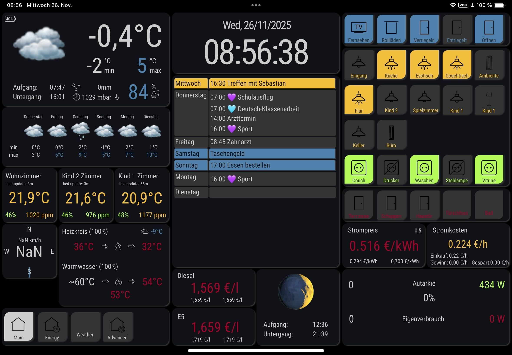

# Home Monitoring

[](https://github.com/BigCrunsh/home-monitoring/actions/workflows/ci.yml)

A centralized monitoring system for smart home devices and services. Python collectors
gather metrics from vendor APIs and store them in InfluxDB; an ioBroker vis-2 dashboard
(the screenshot above) visualizes them on a wall tablet, fed by version-controlled
ioBroker scripts that read from InfluxDB and live sources (Shelly via MQTT).

**Integrations:** [`integrations/iobroker/`](integrations/iobroker/) holds all deployed
ioBroker scripts plus export/deploy/drift tooling — see the development cycle below.

**Roadmap:** [`ROADMAP.md`](ROADMAP.md); each item is an OpenSpec change under
[`openspec/changes/`](openspec/changes/).

## Supported Systems

Active:

- [Netatmo](https://www.netatmo.com/en-eu) - Smart home weather station (OAuth2 with lnetatmo library)
- [SolarEdge](https://www.solaredge.com/) - Solar inverter and PV monitoring (cloud API; power rows arrive ~60-75 min delayed)
- [Tankerkoenig](https://creativecommons.tankerkoenig.de/) - Gas station price monitoring
- [Tibber](https://tibber.com/) - Dynamic electricity tariff: hourly prices, consumption, costs
- SAM Digital - Heating system gateway (flow/return/storage temperatures, valve signals)
- Shelly 3EM - Live grid power at the connection point (via MQTT into ioBroker; anchors the real-time energy states)

Currently disabled (cron entries commented out):

- [Gardena](https://www.gardena.com/de/produkte/smart/) - Smart gardening system (the ioBroker smartgarden adapter is also without data; keep/retire is an open roadmap question)
- Techem Compact V - Heat meter via nanoCUL USB stick (requires pyserial)

Pending:

- Maxxisun/Maxxicharge - second PV system with battery; blocked on the CCU2 local API (see `openspec/changes/add-maxxisun-integration/`)

## Installation

### Prerequisites

- Python 3.12.3 or higher
- Docker
- Git

### Setup Development Environment

1. Clone the repository:
```bash
git clone https://github.com/bigcrunsh/home-monitoring.git
cd home-monitoring
```

2. Initialize the project (creates virtual environment and installs dependencies):
```bash
make init
source .venv/bin/activate
```

3. Set up environment variables:
```bash
# .env is created by make init, edit with your configuration
nano .env
```

### Infrastructure Setup

Run InfluxDB via Docker (no Grafana container by default):

```bash
# Create persistent volume for InfluxDB data
docker volume create influxdb-storage

# Start the InfluxDB container
docker run -d \
  --restart unless-stopped \
  -p 8086:8086 \
  --name=influxdb \
  --volume influxdb-storage:/var/lib/influxdb/ \
  influxdb:1.8
```

Alternatively, you can use the Makefile helpers, which wrap the same commands:

```bash
make init-docker   # create influxdb-storage volume
make start-docker  # start (or create) the influxdb container
make logs-docker   # follow InfluxDB logs
make stop-docker   # stop the influxdb container
```

Service:
- InfluxDB: Time-series database (port 8086)

## Data Collection

### Configuration

All services are configured via environment variables. See `.env.example` for required variables.

### Running Data Collectors

Data collectors and utilities are Python modules located in `src/home_monitoring/scripts/`. Run them from the project root directory with PYTHONPATH set:

```bash
# Data Collection
PYTHONPATH=src python -m home_monitoring.scripts.collect_netatmo_data
PYTHONPATH=src python -m home_monitoring.scripts.collect_solaredge_data
PYTHONPATH=src python -m home_monitoring.scripts.collect_gardena_data
PYTHONPATH=src python -m home_monitoring.scripts.collect_tankerkoenig_data --cache-dir /path/to/cache
PYTHONPATH=src python -m home_monitoring.scripts.collect_tibber_data
PYTHONPATH=src python -m home_monitoring.scripts.collect_sam_digital_data
PYTHONPATH=src python -m home_monitoring.scripts.collect_techem_data --serial-port /dev/ttyUSB0
```

Note: The `-v` flag is not supported by all scripts.

Additional options for specific collectors:

**Tibber:**
```bash
# Collect both prices and consumption data
PYTHONPATH=src python -m home_monitoring.scripts.collect_tibber_data

# Optional: specify custom user agent
PYTHONPATH=src python -m home_monitoring.scripts.collect_tibber_data --user-agent "MyApp/1.0"
```
- `collect_tankerkoenig_data.py`:
  - `--cache-dir`: Directory to cache station details
  - `--force-update`: Force update of station details from API
- `collect_techem_data.py`:
  - `--serial-port`: Serial port path (default: /dev/serial/by-id/usb-SHK_NANO_CUL_868-if00-port0)
  - `--serial-baudrate`: Baud rate (default: 38400)
  - `--serial-timeout`: Timeout in seconds (default: 300)
  - `--serial-num-packets`: Number of packets to collect (default: 5)

### Scheduling Collections

Collections run via cron through the wrapper script (make it executable once:
`chmod +x run_home_monitoring.sh`). The crontab as deployed on the Pi (active
collectors every 5 minutes, healthcheck hourly; Gardena and Techem are disabled):

```
*/5 * * * * /home/pi/src/github.com/BigCrunsh/home-monitoring/run_home_monitoring.sh home_monitoring.scripts.collect_netatmo_data >> /home/pi/logs/netatmo.log 2>&1
*/5 * * * * /home/pi/src/github.com/BigCrunsh/home-monitoring/run_home_monitoring.sh home_monitoring.scripts.collect_solaredge_data >> /home/pi/logs/solaredge.log 2>&1
*/5 * * * * /home/pi/src/github.com/BigCrunsh/home-monitoring/run_home_monitoring.sh home_monitoring.scripts.collect_tankerkoenig_data --cache-dir /home/pi/src/github.com/BigCrunsh/home-monitoring/cache >> /home/pi/logs/tankerkoenig.log 2>&1
*/5 * * * * /home/pi/src/github.com/BigCrunsh/home-monitoring/run_home_monitoring.sh home_monitoring.scripts.collect_tibber_data >> /home/pi/logs/tibber.log 2>&1
*/5 * * * * /home/pi/src/github.com/BigCrunsh/home-monitoring/run_home_monitoring.sh home_monitoring.scripts.collect_sam_digital_data >> /home/pi/logs/sam_digital.log 2>&1
30 * * * * /home/pi/src/github.com/BigCrunsh/home-monitoring/run_home_monitoring.sh home_monitoring.scripts.healthcheck >> /home/pi/logs/healthcheck.log 2>&1
#*/30 * * * * ... collect_gardena_data   (disabled — see ROADMAP open questions)
#0 1 * * *   ... collect_techem_data     (disabled)
```

Logs land in `/home/pi/logs/` and are rotated weekly (4 weeks kept).

### Security posture

The Pi is a **LAN-only** host; no service is intended to face the internet.

- **InfluxDB (8086)** is bound to `127.0.0.1` — reachable only on the Pi (the
  collectors use `127.0.0.1`, the ioBroker `influxdb.0` adapter uses `localhost`).
- **ioBroker admin (8081)** requires a login. **vis (8082)** is served without a
  login on the trusted LAN — acceptable only because nothing is port-forwarded.
- **Disabled** as unused attack surface: the `terminal` ioBroker adapter (8090)
  and `xrdp`/Remote Desktop (3389).
- **Remote access is WireGuard-only.** Never port-forward raw services (InfluxDB,
  ioBroker admin/vis) to the internet. The former `monitoring.sawade.me` (Dynu)
  port-forward + dynamic-DNS updater have been retired in favour of WireGuard.

### Backup & recovery

Two independent, daily backups:

1. **ioBroker `backitup`** — app-level archive of the ioBroker config/objects/
   scripts/vis, 02:40 daily, 10 kept in `/opt/iobroker/backups/`.
2. **Synology NAS pull** (`deps/general/bin/backup_pi.sh`, runs *on the NAS* via
   DSM Task Scheduler, 04:00) — rsyncs the whole Pi filesystem (incl. `/home/pi`,
   `/opt/iobroker`, and the InfluxDB data) to `/volume1/rpi_backup/raspberrypi/`
   as `--link-dest` hardlink-incremental dated snapshots, 14 days retained.

A consistent InfluxDB snapshot is produced on the Pi at 03:30
(`deps/general/bin/influx_backup.sh`, portable `influxd backup` →
`/home/pi/influx_backup`) so the 04:00 pull captures a clean dump rather than
live data files. Deploy the NAS script by copying it to
`/volume1/rpi_backup/scripts/backup_pi.sh`.

**Monitoring:** the hourly healthcheck alerts via Telegram if either backup goes
stale (newest `backitup` archive, or the `/home/pi/.last_nas_backup_success`
marker the NAS pull touches) — SLAs in `conf/healthcheck.json`.

**Restore (verified 2026-06-11):** InfluxDB — `influxd restore -portable -db
home_monitoring -newdb <tmp> /backup` into a throwaway `influxdb:1.8` container,
confirm row counts, then restore into production. ioBroker — restore the
`backitup` archive via the adapter. Collectors — `git clone`, venv, `.env`,
crontab. This procedure is the dry-run for `upgrade-pi-os`.

**Known gaps (tracked):** no verified offsite copy (both copies are on-site — 3-2-1
gap); the NAS (DS214play) is EOL and unpatched. See
`openspec/changes/.../harden-backup-and-recovery`.

### Freshness monitoring

An hourly healthcheck (`home_monitoring.scripts.healthcheck`, cron `30 * * * *`)
compares every measurement's newest data point against its SLA and alerts via
Telegram (through the ioBroker telegram adapter). Stale alerts repeat at most once
per 24 h; recoveries notify once; an unreachable InfluxDB alerts about the
monitoring itself.

SLAs live in [`conf/healthcheck.json`](conf/healthcheck.json): per-measurement
minutes in `slas`, a `default_sla_minutes` fallback for new measurements, and an
`ignore` list for sources that are dead by design (no wind module, Gardena
disabled). Adjust there and commit — no code change needed.

## Dashboard & ioBroker Integration

The wall-tablet dashboard (ioBroker vis-2, served from the Pi) has two layers:

- **Logic** — the ioBroker JavaScript scripts that compute every displayed value
  (e.g. `solaredge_power.js` for the real-time energy states, `tibber_states.js` for
  price/cost statistics). **Fully version-controlled** in
  [`integrations/iobroker/`](integrations/iobroker/) — the repo is the source of
  truth; never edit scripts in the admin UI first.
- **Layout** — the vis-2 widget arrangement, versioned in
  [`integrations/iobroker/vis/main/`](integrations/iobroker/vis/main/)
  (`vis-views.json`, `vis-user.css`). Export after editing in the vis editor
  (`tools/export_vis.sh` + commit); restore/deploy with `tools/deploy_vis.sh`
  (interactive, overwrites the live layout).

### Development cycle for dashboard logic

```
edit on the workstation → commit → push → pull on the Pi → deploy → verify
```

```bash
# 1. edit integrations/iobroker/<name>.js in the repo, commit, push

# 2. on the Pi:
cd ~/src/github.com/BigCrunsh/home-monitoring
git pull
./integrations/iobroker/tools/deploy_script.sh <name>   # auto-restarts the script

# 3. verify
./integrations/iobroker/tools/check_drift.sh   # deployed == repo for all scripts
```

Rollback = check out any earlier version of the script and run `deploy_script.sh`
again. If a script was edited in the admin UI in a pinch, `check_drift.sh` flags it;
export with `tools/export_scripts.sh` and commit, or redeploy from the repo to
overwrite. Details and the full script inventory:
[`integrations/iobroker/README.md`](integrations/iobroker/README.md).

## Development

### Project Structure

```
src/
├── home_monitoring/
│   ├── core/         # Core business logic
│   ├── models/       # Data models
│   ├── repositories/ # Data access layer
│   ├── schemas/      # Data validation schemas
│   ├── scripts/      # Data collection scripts
│   ├── services/     # Service integrations
│   └── utils/        # Utility functions
tests/
├── unit/            # Unit tests
└── integration/     # Integration tests
```

### Development Commands

```bash
# Run all tests and quality checks
make test

# Run specific test suites
make test-unit
make test-integration

# Code quality
make lint          # Run all code quality checks
make format        # Format code with black
make type-check    # Run type checking
make ruff          # Run linting with ruff

# Clean up
make clean         # Remove Python artifacts and caches
```

### Code Quality Standards

- Black for code formatting
- Ruff for linting
- MyPy for type checking
- Tests required for new logic (target ratio 2:1 unhappy:happy paths; mappers and the
  repository layer are well covered, scripts less so)
- Docstrings required for public APIs
- Type hints required for all functions

## InfluxDB Measurements

The system writes all metrics to InfluxDB using a consistent
`<domain>_<metric>_<unit>` naming scheme (for example
`electricity_power_watt` or `garden_humidity_percentage`).

High-level categories (live schema, 2026-06):
- **Electricity & energy**: `electricity_energy_watthour`, `electricity_power_watt`, `electricity_prices_euro`, `electricity_consumption_kwh`, `electricity_costs_euro`
- **Heating** (SAM Digital): `heat_temperature_celsius`, `heat_valve_signal_percentage` (`heat_energy_watthours` only when the Techem collector is enabled)
- **Fuel prices**: `gas_prices_euro`
- **Weather** (Netatmo): `weather_temperature_celsius`, `weather_humidity_percentage`, `weather_pressure_mbar`, `weather_co2_ppm`, `weather_noise_db`, `weather_rain_mm`, `weather_system_battery_percentage` (wind/gust measurements exist in the schema but have no source module)
- **Garden & irrigation** (Gardena, currently empty — collector disabled): `garden_temperature_celsius`, `garden_humidity_percentage`, `garden_light_intensity_lux`, `garden_rf_link_level_percentage`, `garden_system_battery_percentage`, `garden_valves_activity`

For full details (fields, tags, update frequency) see
`INFLUXDB_MEASUREMENTS_DOCUMENTATION.md`.

## Querying InfluxDB

Once InfluxDB is running and populated, you can query it via the
**InfluxDB CLI**.

### Using the InfluxDB CLI

If you run InfluxDB via the single-container Docker setup described
above, you can open a shell in the container and start the Influx
shell:

```bash
docker exec -it influxdb /bin/bash
influx
USE home_monitoring
SHOW MEASUREMENTS
```

Replace `home_monitoring` with the database name you configured in
your `.env` file if it differs.

### Example InfluxQL queries

- **Daily solar energy consumption for the last 30 days**

  ```sql
  SELECT SUM("Consumption")
  FROM "electricity_energy_watthour"
  WHERE time >= now() - 30d
  GROUP BY time(1d)
  ```

- **Latest solar power reading**

  ```sql
  SELECT LAST("Consumption")
  FROM "electricity_power_watt"
  WHERE time >= now() - 1h
  ```

- **Average indoor temperature from a Netatmo module**

  ```sql
  SELECT MEAN("Temperature")
  FROM "weather_temperature_celsius"
  WHERE "module_name" = 'Living Room'
    AND time >= now() - 24h
  GROUP BY time(1h)
  ```

- **Latest soil humidity from a Gardena soil sensor**

  ```sql
  SELECT LAST("humidity")
  FROM "garden_humidity_percentage"
  WHERE "name" = 'Soil Sensor'
  ```

- **Last 24 hours of electricity price from Tibber**

  ```sql
  SELECT "total"
  FROM "electricity_prices_euro"
  WHERE time >= now() - 24h
  ORDER BY time DESC
  LIMIT 24
  ```

### Programmatic Access

The Tibber service provides methods to retrieve energy cost and consumption data:

```python
from home_monitoring.services.tibber.service import TibberService

# Initialize service
service = TibberService()

# Get cost for the last complete hour
last_hour_cost = await service.get_last_hour_cost()
print(f"Last hour cost: {last_hour_cost:.2f} EUR")

# Get consumption for the last complete hour
last_hour_consumption = await service.get_last_hour_consumption()
print(f"Last hour consumption: {last_hour_consumption:.2f} kWh")

# Get cost for yesterday
yesterday_cost = await service.get_yesterday_cost()
print(f"Yesterday's total cost: {yesterday_cost:.2f} EUR")

# Get consumption for yesterday
yesterday_consumption = await service.get_yesterday_consumption()
print(f"Yesterday's total consumption: {yesterday_consumption:.2f} kWh")

```

These queries can be pasted directly into the InfluxDB CLI, or into
external visualization tools such as Grafana (InfluxDB data source,
InfluxQL mode) or ioBroker, if you choose to use them.

## Contributing

> **Note:** on 2026-06-11 the git history was rewritten (`git filter-repo`, removal of
> a file with personal data) and the default branch renamed `master` → `main`. Clones
> made before that date must be re-cloned; their commit hashes no longer match.

1. Fork the repository
2. Create a feature branch
3. Make your changes
4. Run tests and linting (`make test`)
5. Submit a pull request

## License

MIT License - see LICENSE file

## References

- [InfluxDB Documentation](https://docs.influxdata.com/influxdb/v1.8/)
- [Grafana Documentation](https://grafana.com/docs/)
- [Python asyncio](https://docs.python.org/3/library/asyncio.html)
- [Black Code Style](https://black.readthedocs.io/en/stable/the_black_code_style/current_style.html)
- [MyPy Type System](https://mypy.readthedocs.io/en/stable/)
