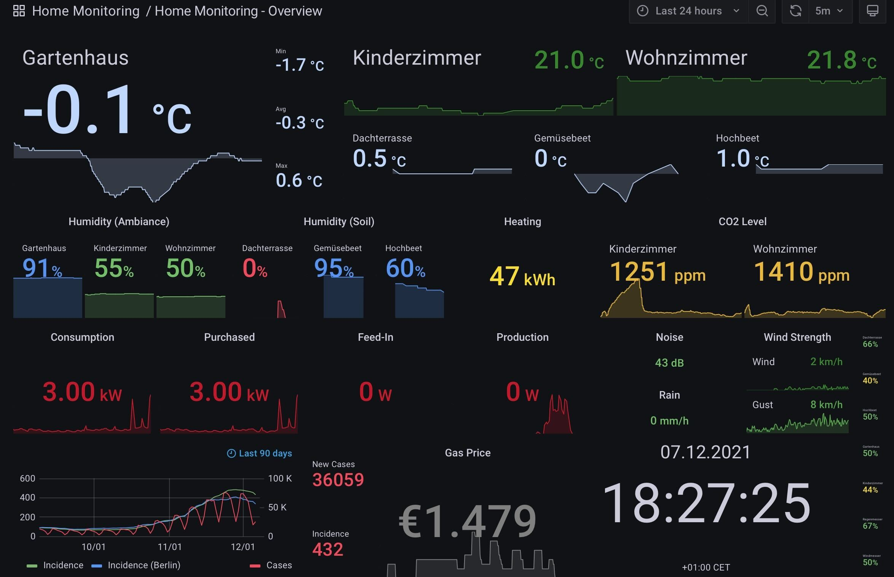

[](https://travis-ci.com/BigCrunsh/home-monitoring)



# Home Monitoring
Different smart home application typically come with their own interfaces. As a user I want to have a central place to monitor the central metrics recorded by the different systems.

The project consolidates different scripts and configuration to collect home
montitoring metrics on a Raspberry PI 4; we use an influxDB to store and grafana to visualize the measurements.

Systems to Monitor:
- [Netatmo](https://www.netatmo.com/en-eu) is a smart home weather station.
- [SolarEdge](https://www.solaredge.com/) is a solar
	inverter and monitoring systems for photovoltaic arrays
- [Tankerkoenig](https://creativecommons.tankerkoenig.de/) provides gas station prices
- Techem Compat V energy meter is monitored via a nanoCUL USB Stick (FTDI CC1101 868MHz FW 1.67 FHEM).

## Setup Monitoring
The different components run as [docker](https://www.docker.com/) containers.

### InfluxDB
[Docker volumes](https://docs.docker.com/storage/volumes/) can be used by different docker containers to persist data and managed by docker. To create a persistent volume for the influx database, run
```bash
docker volume create influxdb-storage
```
To (download and) start the influxdb container, run
```bash
docker run -d \
 --restart unless-stopped \
 -p 8086:8086 \
 --name=influxdb \
 --volume influxdb-storage:/data \
 hypriot/rpi-influxdb
```
to enable the HTTP endpoint on port `8086`.

### Grafana
To create a persistent volume for the grafana database and plugins, run
```bash
docker volume create grafana-storage
```

To (download and) start the [grafana container](https://grafana.com/grafana/download?platform=docker), run
```bash
docker run -d \
 --restart unless-stopped \
 --net=host \
 --name=grafana \
 --volume grafana-storage:/var/lib/grafana \
 --env "GF_INSTALL_PLUGINS=grafana-clock-panel, grafana-worldmap-panel" \
 grafana/grafana
```
The grafana endpoint can be accessed on port `3000` and the login is `admin` (user name and password).

#### SSL HTTPS
The principal steps including the generation of the SSL Certificate is describe in this [blog post](https://www.turbogeek.co.uk/grafana-how-to-configure-ssl-https-in-grafana/). Check the container name and group of the user to set the right permissions of the files (see [grafana docker](https://grafana.com/docs/grafana/latest/installation/docker/)).

To start the grafana container with SSL, run
```bash
docker run -d \
 --restart unless-stopped \
 --net=host \
 --name=grafana \
 --env "GF_SERVER_CERT_FILE=/etc/grafana/grafana.crt" \
 --env "GF_SERVER_CERT_KEY=/etc/grafana/grafana.key" \
 --env "GF_SERVER_PROTOCOL=https" \
 --volume $(pwd)/grafana.key:/etc/grafana/grafana.key \
 --volume $(pwd)/grafana.crt:/etc/grafana/grafana.crt \
 --volume grafana-storage:/var/lib/grafana \
 grafana/grafana
```
Note that additionally to the command on top, we mount the certificate files and set the https configs as environment variables instead of changing the `grafana.ini`  (see [grafana configuration](https://grafana.com/docs/grafana/latest/administration/configuration/) for details).

## Setup Data Collection Jobs
The data collection jobs are scheduled via cron (`crontab -e`), e.g.,
```bash
DNSEXIT_HOST="..."
DNSEXIT_LOGIN="..."
DNSEXIT_PASSWORD="..."

TANKERKOENIG_API_KEY="..."

SOLAREDGE_API_KEY="..."

NETATMO_USERNAME="..."
NETATMO_PASSWORD="..."
NETATMO_CLIENT_ID="..."
NETATMO_CLIENT_SECRET="..."

INFLUXDB_HOST="127.0.0.1"
INFLUXDB_PORT=8086
INFLUXDB_USER="..."
INFLUXDB_PASS="..."
INFLUXDB_DB="home_monitoring"


*/5 * * * * /home/pi/src/github.com/BigCrunsh/home-monitoring/homemonitoring/collect_data_tankerkoenig.py > /home/pi/logs/collect_data_tankerkoenig.log 2>&1
*/5 * * * * /home/pi/src/github.com/BigCrunsh/home-monitoring/homemonitoring/collect_data_netatmo.py > /home/pi/logs/collect_data_netatmo.log 2>&1
*/5 * * * * /home/pi/src/github.com/BigCrunsh/home-monitoring/homemonitoring/collect_data_solaredge.py > /home/pi/logs/collect_data_solaredge.log 2>&1
01 0 * * * /home/pi/src/github.com/BigCrunsh/home-monitoring/homemonitoring/collect_data_techem.py > /home/pi/logs/collect_data_techem.log 2>&1
0 * * * * /home/pi/src/github.com/BigCrunsh/home-monitoring/homemonitoring/update_dns.py > /home/pi/logs/update_dns.log 2>&1
```


# References
- [Monitoring your home network with InfluxDB on Raspberry Pi with Docker](https://mostlyoperational.com/posts/2017-12-28_monitoring-your-home-network-with-influxdb-on-raspberry-pi-with-docker/)
- [Docker Image with InfluxDB and Grafana](https://hub.docker.com/r/philhawthorne/docker-influxdb-grafana/)
